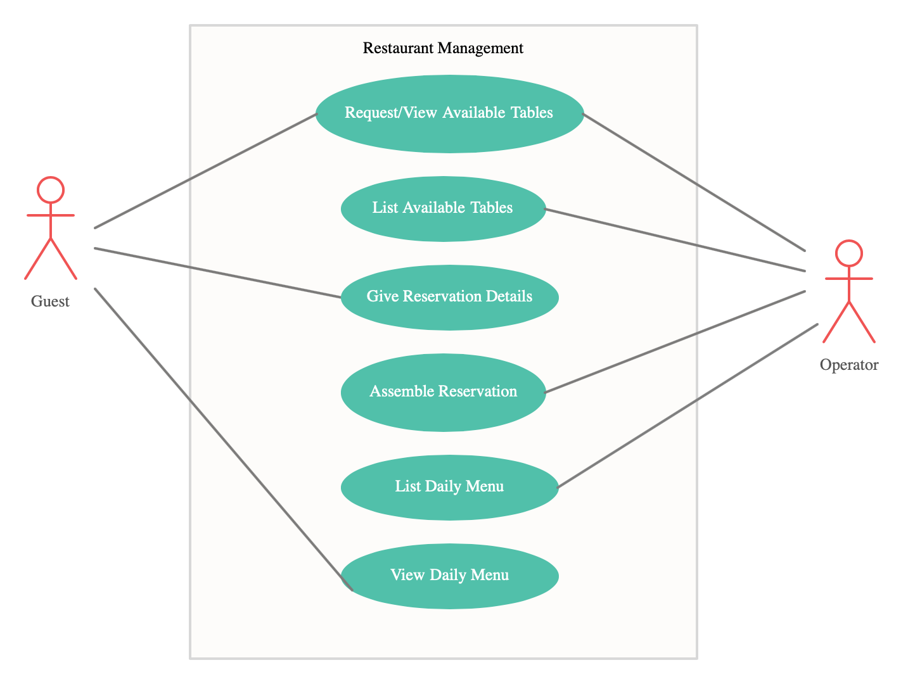
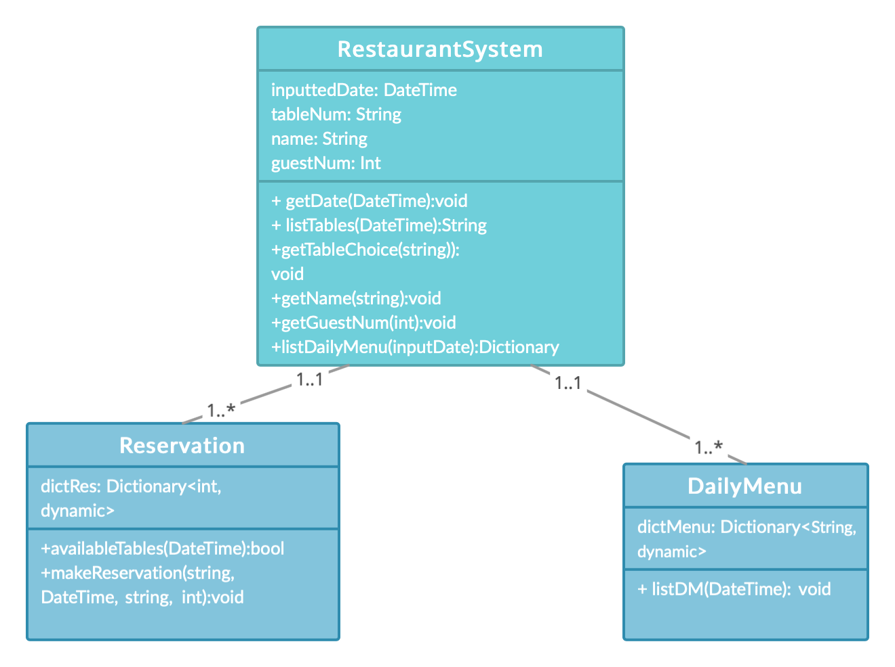
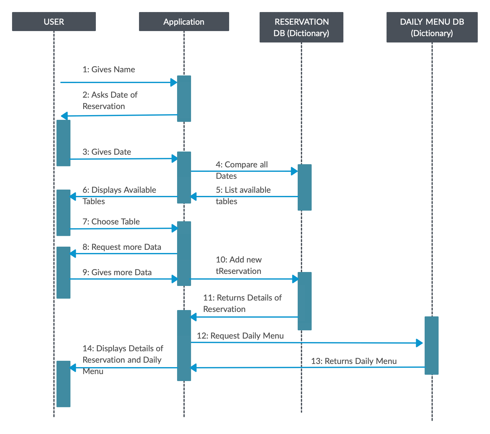
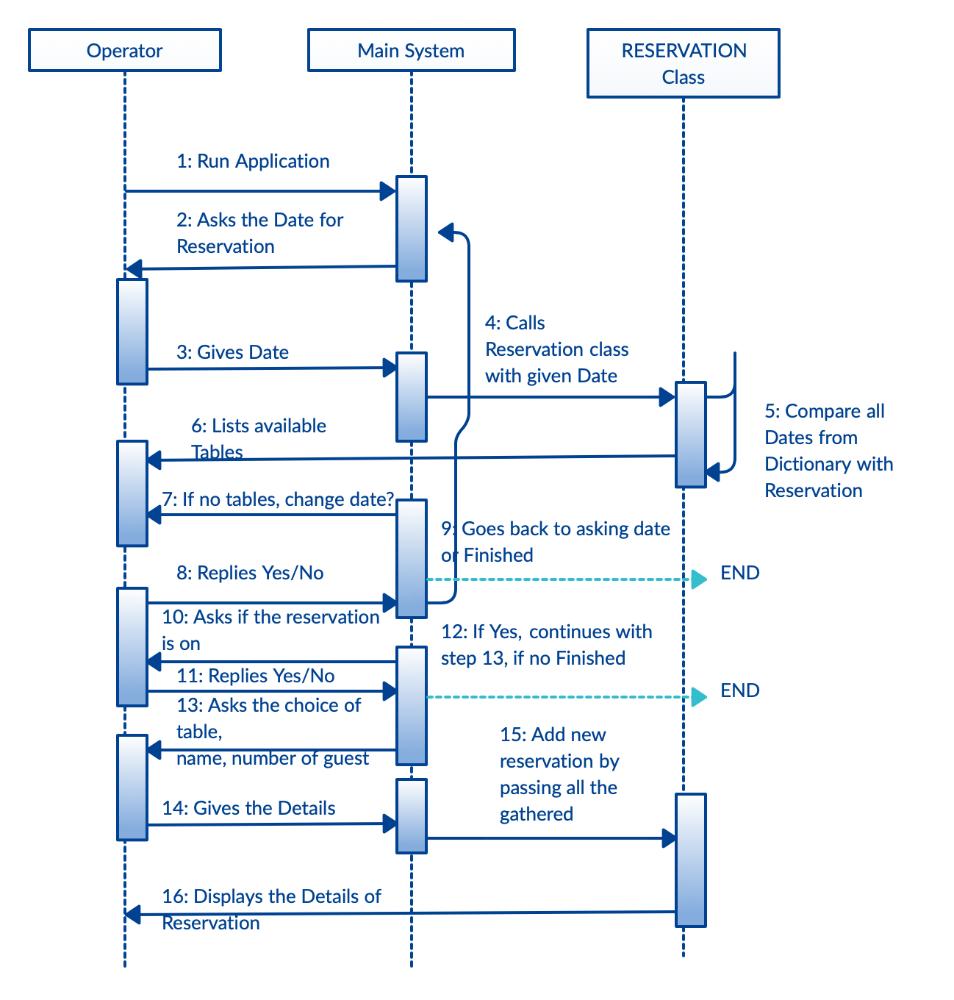

# DevSWAppHW
This is the simplest .NET Console Application written on C# for Restaurant Management System.  
  
Inside of the RestarauntManagement folder (sorry for typo in Restaurant word) there are 3 source files: RestarauntSystem.cs, Reservation.cs and DailyMenu.cs. The class with main() method is RestarauntSystem.cs, from where the communication with the Guest is processed, and the rest classes with their corresponding methods are called (for listing available tables, making the reservation and listing Daily Menu). 
Below the Use-Case, Class and Sequence diagrams are provided. 

